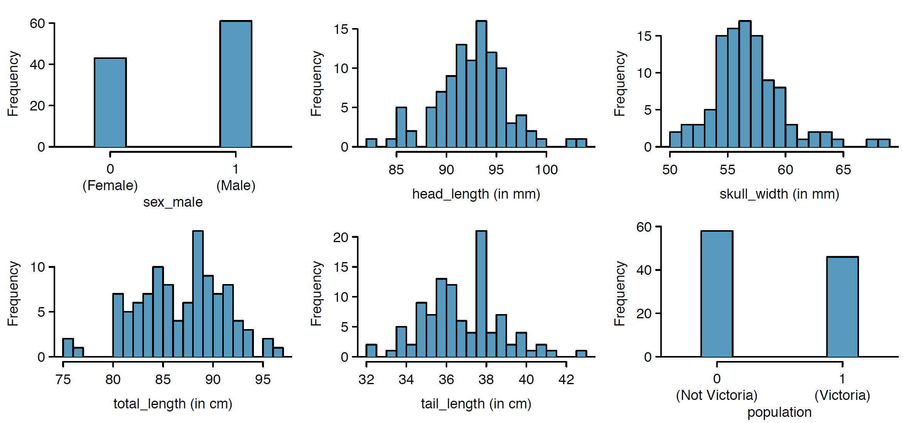
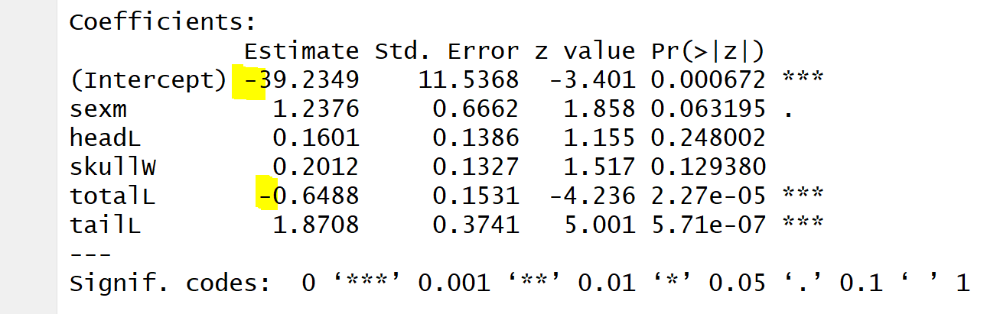
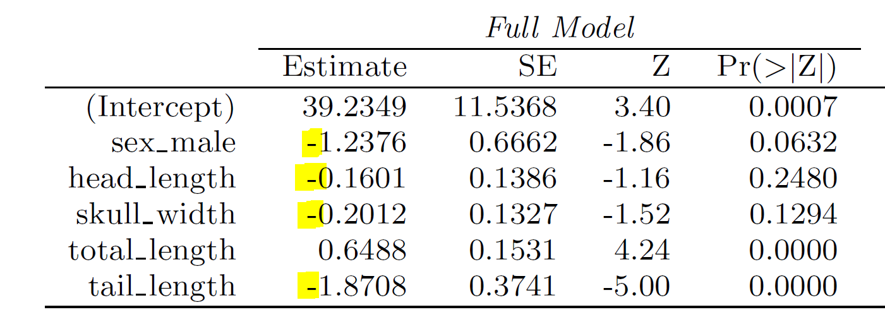
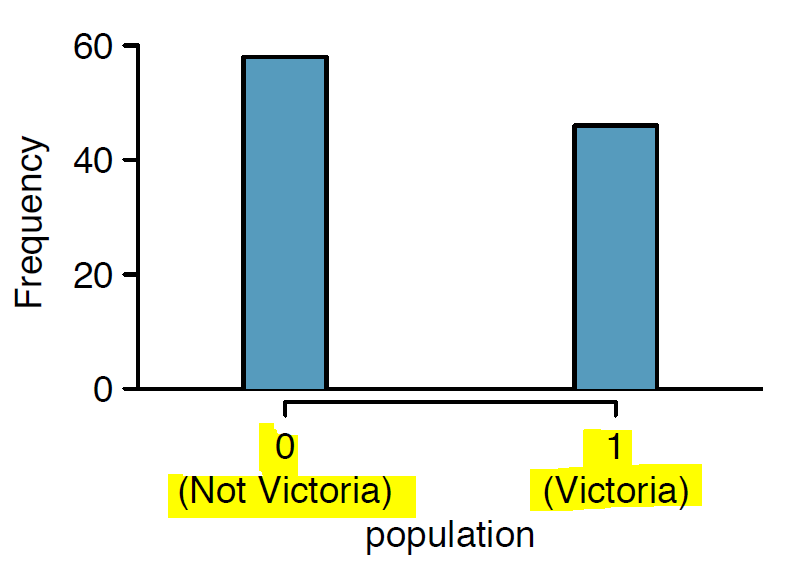
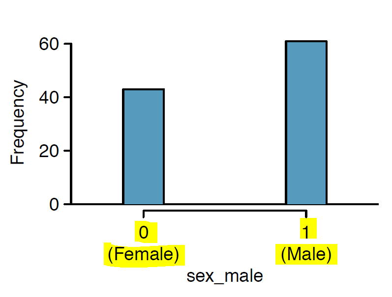

```{r setup, echo=FALSE, results='hide', warning=FALSE, message=FALSE}
#knitr::opts_chunk$set(echo = FALSE)
#setwd("c:/users/Michael/DROPBOX/priv/CUNY/MSDS/201902-Spring/DATA606-Jason/Slides")
library(ggplot2)
library(openintro)
library(DATA606)
library(reshape2)
library(psych)
library(xtable)
library(curl)
options(width=100)
par(mar=c(2.5, 1, 2, 1))
```

## Possums!
The textbook has two problems using a dataset on Australian possums: 8.15 and 8.17
<left></left>
<right></right>

Photo credits: Greg Schechter, Arnaud Delberghe (via Flickr)

- Another classmate will be discussing 8.15 next week, so I'll present 8.17 today
- However, I have to touch on the description of the data, which is given in 8.15
- There is an issue with the data as stored in the datset, which makes it inconsistent with the textbook
- However, this can be fixed


## The possum data set has 104 observations:
```{r loaddata,eval=T,echo=T}
require(openintro)
data(possum)
head(possum)
tail(possum)
```

## Data Summary

```{r data-summary, eval=T,echo=T}
summary(possum)
```

- The goal is to perform a logistic regression to predict whether a possum is from Victoria (Southeastern Australia) or from elsewhere in Australia based upon its **sex**, **head length**, **skull width**, **total length**, and **tail length**.  (**Age** is not considered, perhaps because it contains 2 NA values, which would require imputation or exclusion.)


## The textbook gives plots for 6 variables:
<center></center>

## We can reproduce the plots (plus some color...)
- **First three plots:**
```{r myplots, eval=T, echo=T,fig.height=3, fig.width=10}
par(mfrow = c(1,3))
barplot(table(possum$sex),names.arg=c("Female","Male"),col=c("pink","blue"),xlab="sex_male",ylab="Frequency",main="Possums: Sex",width=c(1,1),space=2)
hist(possum$headL,breaks=22,col="lightblue",xlab="head length (in mm)",ylab="Frequency",main="Possums: Head Length")
hist(possum$skullW,breaks=22,col="lightgreen",xlab="skull width (in mm)",ylab="Frequency",main="Possums: Skull Width")
```

## Reproduced Plots (2)
- **Second row of plots:**
```{r myplots2, eval=T, echo=T,fig.height=3, fig.width=10}
par(mfrow = c(1,3))
hist(possum$totalL,breaks=22,col="brown",xlab="total length (in cm)",ylab="Frequency",main="Possums: Total Length")
hist(possum$tailL,breaks=22,col="red",xlab="tail length (in cm)",ylab="Frequency",main="Possums: Tail Length")
barplot(table(possum$pop),col=c("pink","blue"),xlab="population",ylab="Frequency",main="Possums: Geographic Distribution",width=c(1,1),space=2)
```

## Logistic Regression (from 8.15)
```{r logit1,eval=T,echo=T,fig.width=6}
p_reg1 <- glm(pop ~ sex + headL + skullW + totalL + tailL,data=possum,family=binomial)
summary(p_reg1)
```

## What's up with the signs on the coefficients?!
- There's a discrepancy here: Note that the **signs** on the coefficients on the above regression:
<center></center>

- are **flipped** vs. the signs on the results shown in the textbook:
<center></center>

- Why could this be?

## Let's look closely at categorical variables:
<left>
```{r plot-pop, eval=T, echo=T, fig.height=3, fig.width=4}
barplot(table(possum$pop),width=c(1,1),space=2,col=c("pink","blue"),xlab="population",ylab="Frequency",main="Possums: Geographic Distribution")
```
</left>
<right></right>

- Note that the order is **reversed**: In our data set, **"Vic"** appears on the **Left** while **"other"** appears on the right, but...

- In the subplot in the textbook, **"Not Victoria"** appears on the **left** (above a **"0"**), while **"Victoria"** is on the **right** (above a "**1**")

## Assignment of Factors on categorical variables

- The textbook states that **"Victoria"** should be stored as **"1"**, and **"Not Victoria"** should be stored as **"0"**.
```{r factor-victor-victoria,eval=T,echo=T}
# Integer values of the factor
table(possum$pop)
```
- However, the possum data table *actually* stores **"other"** (i.e., **"Not Victoria"**) as a **"2"** rather than **"0"**.
```{r factor-victor-victoria2,eval=T,echo=T}
table(as.integer(possum$pop))
```

## We can fix this:

- By creating a new population variable ("NEWpop") which is defined as (**2** minus the **original**), 
- the value associated with **"Not Victoria"** becomes **"0"**, as expected per the textbook
```{r reassign-pop, eval=T, echo=T}
possum$NEWpop = as.factor( 2 - as.integer(possum$pop))
table(possum$NEWpop)
```


## Having forced "Not Victoria" to be "0" (rather than "2")
<left>
```{r plot-NEWpop, eval=T, echo=T, fig.height=3, fig.width=4}
barplot(table(possum$NEWpop),
        col=c("blue","pink"),width=c(1,1),space=2,names.arg = c("Not Victoria","Victoria"),
        xlab="population",ylab="Frequency",main="Possums: Geographic Distribution")
```
</left>
<right></right>

- Observe that the values are now displayed in the expected sequence

## We obtain the expected signs on the coefficients:
```{r logit2, eval=T, echo=T, fig.height=2, fig.width=6}
p_reg2 <- glm(NEWpop ~ sex + headL + skullW + totalL + tailL, data=possum, family=binomial)
summary(p_reg2)
```


## Question 8.17 drops one variable:
- **Head Length** has been shown to be not significant, so it is dropped.
- The reduced model is as follows:
```{r logit3, eval=T, echo=T, fig.height=2, fig.width=6}
p_reg3 <- glm(NEWpop ~ sex +         skullW + totalL + tailL, data=possum, family=binomial)
summary(p_reg3)
```

## 8.17(a) - Write out the form of the model
$$ logit(\hat{p_i})=ln \left( \frac{\hat{p_i}}{1-\hat{p_i}} \right) = 
\begin{matrix} 
33.5095\\ \\ 
\end{matrix} 
\begin{matrix} 
- 1.4207 \times sex\_male_i
- 0.2787 \times skull\_width_i \\
+ 0.5687 \times total\_length_i
- 1.8057 \times tail\_length_i 
\end{matrix}$$
- **Also identify which of the variables are positively associated when controlling for other variables.**
The only variable with a positive coefficient is `total_length`.  This means that it is the only variable which is positively associated with a possum being from Victoria. (i.e., possoms from Victoria tend to be, on average, slightly **longer** than possums from elsewhere, but they have significantly **shorter tails**.)

- For the **numeric** variables, we can confirm this by segmenting the data by population:
```{r test-association, eval=T, echo=T}
by(data = possum[,c("skullW","totalL","tailL")], INDICES = possum$pop, FUN=colMeans)
```
The average value for **"totalL"** is greater for the **"Vic"** segment, while the average values for **"skullW"** and for **"tailL"** are larger for the **"other"** segment.

## Do we need to worry about the other categorical variable?
- Earlier we discovered that the way in which **"pop"** is stored in the dataset is not consistent with the description in the textbook, causing the signs on all the regression coefficients to flip.
- The other categorical variable is **"sex"** - according to the plot in the textbook, we assume sex=**male** corresponds to to "1", while sex=**female** corresponds to "0":
<left>
```{r check-male-female,eval=T,echo=T,fig.height=3,fig.width=4}
barplot(table(possum$sex),names.arg = c("Female","Male"),col=c("pink","blue"),xlab="sex_male",ylab="Frequency", main="Possums: Sex", width=c(1,1),space=2)
```
</left>
<right></right>

## As it turns out, the factor levels behind "sex" are not what we expect
- We are expecting that **"Female"** should be stored as **"0"** while **"Male"** should be stored as **"1"**
```{r factor victor-victoria3,eval=T,echo=T}
# table of the "sex" factor:
table(possum$sex)
```
- ***However,*** the possum dataset *actually* stores **"Female"** as a **"1"** , while **"Male"** is stored as a **"2"** :
```{r factor victor-victoria4,eval=T,echo=T}
# integer values of the "sex" factor:
table(as.integer(possum$sex))
```

- Because the **order** is unchanged, the sign on the regression coefficient does not flip.

## Are male possums less prevalent in Victoria?
```{r sex-table-abs,eval=T,echo=T}
# On an ABSOLUTE basis:
table(possum$pop, possum$sex)
# On a PERCENTAGE basis:
table(possum$pop, possum$sex)/length(possum$pop)
```
- This explains the negative coefficient on **"sex"**: ***For this sample***, more Female possums were observed in Victoria, while more Male possums were observed elsewhere.  
- However, is it reasonable that there should actually be *more than twice as many males as females* in the "other" region?  Or, is it more plausible that this happens to be an unfortunate quirk of a small sample?

## 8-17(b) - Aussie possum in America
- "Suppose we see a brushtail possum at a zoo in the US, and a sign says the possum had been captured in the wild in Australia, but it doesn't say which part of Australis.  However, the sign does indicate that the possum is:"
- **Male**; its **skull** is about 63mm wide; its **tail** is 37cm long, and its **total length** is 83cm.
- ***What is the reduced model's probability that this possum is from Victoria?***
```{r calc-prob1, eval=T, echo=T}
this_possum = c(1, 1, 63, 83, 37)  # c(intercept, male, skullW, totalL, tailL)
rbind(coefs=p_reg3$coefficients,this_possum,product=p_reg3$coefficients*this_possum)
```
```{r calc-prob2, eval=T, echo=T}
logit_p = sum(p_reg3$coefficients*this_possum)
logit_p
```

## Solve for the probability
- The logit value is the dot-product of the coefficients and the variables
- For this example, the logit value is `r logit_p`
$$ logit (\hat{p_i} ) = ln \left( \frac{\hat{p_i}}{1-\hat{p_i}} \right) = `r logit_p` $$
$$ e^{logit (\hat{p_i} )} =  \frac{\hat{p_i}}{1-\hat{p_i}}  = e^{`r logit_p`} = `r exp(logit_p)` $$
$$ \hat{p_i} = \frac { e^{logit(\hat{p_i} )}}{1+e^{logit(\hat{p_i} )}} = \frac{`r exp(logit_p)`}{1+`r exp(logit_p)`} 
= \frac{`r exp(logit_p)`}{`r 1+exp(logit_p)`} 
= `r exp(logit_p)/(1+exp(logit_p))`$$
- In R, we can do the above calculations manually, or we can use the ***"logistic"*** function
```{r calc-prob3,eval=T,echo=T}
phat <-logistic(logit_p)
phat
```

## How confident are you in the model's accuracy of this probability calculation?

- Given that the logistic value is quite low, `r phat`, this model gives strong evidence that the possum in question is ***not*** from Victoria -- *assuming that the model is correct*.

- The data that has been collected covers a relatively modest number of samples (n=104).  The key question in determining correctness of the model is whether this sample is representative of the population of possums across the subject regions (Victoria, New South Wales, and Queensland, Australia.)

- One would expect that ***the wide discrepancy in the number of males and females by region*** as observed in ***this*** sample may suggest that ***this sample may not be representative of the actual population*** across each region.

- The result is that the measurements of the large number of male possums from the "other" (non-Victoria) regions may have biased these results in their favor.

- The model could be improved if the sampling were revised to obtain additional samples in the regions so as to more evenly balance out the number of males and females.
